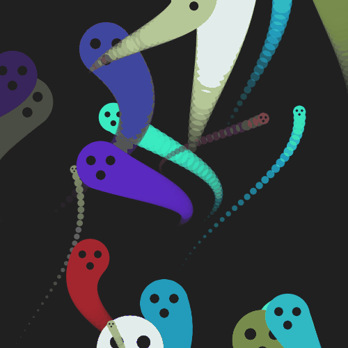
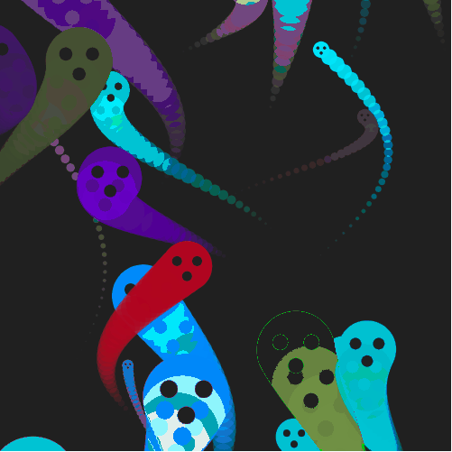
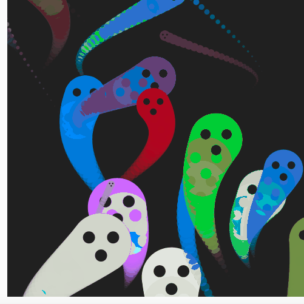
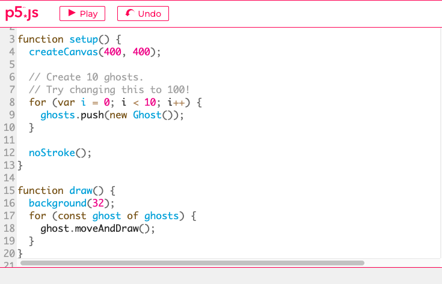
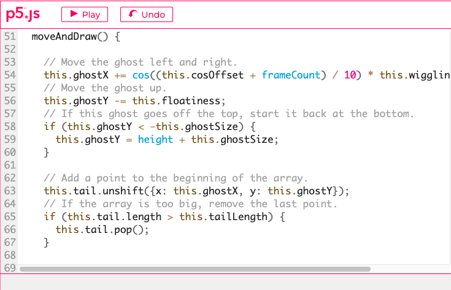

# jhan0187_9103_tut2

## Part 1
I got inspiration from the "ghosts" in happy coding. 
- We will draw an animated image in the coding major project, which is similar to "The Scream" by Edvard Munch. 
- In that project, we might draw a sky that constantly changes its colour and a person with painful and grimacing facial expressions. As the painful face resembles a ghost face, we can mimic the "ghosts" in our project and add more animations such as rotating the person's face just as rotating ghosts' bodies.
- Therefore, we can use "ghosts" as an inspiring work because of its similar style and creative animation.

## Part 2
This is a good example to draw our own project since it uses much in-class knowledge such as "for-loop", "if-else", and "array". 
1. It uses for-loop to draw 10 different ghosts
2. It uses the trigonometric of cosine to show the changing position of the ghost from left to right in the method of move and draw. 
3. "Array" is used to draw the ghosts' tails. 

- We can get insights from the moveandDraw() method to make the person's face turn from left to right.
- Also, we can use similar ellipses to draw the person's face just as the ghost's face in happycoding.

[Link of the ghosts code](https://happycoding.io/tutorials/p5js/creating-classes/ghosts)

